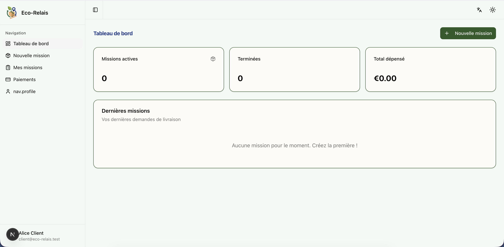
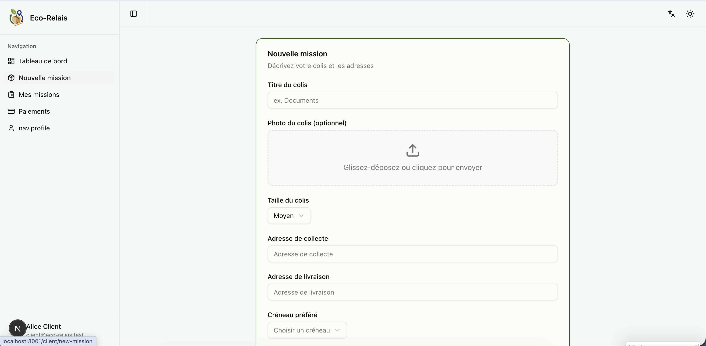
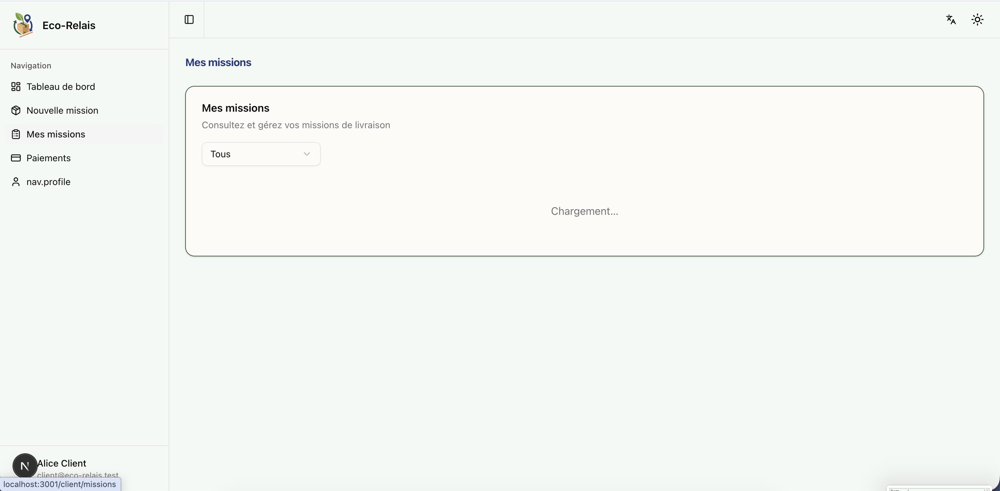
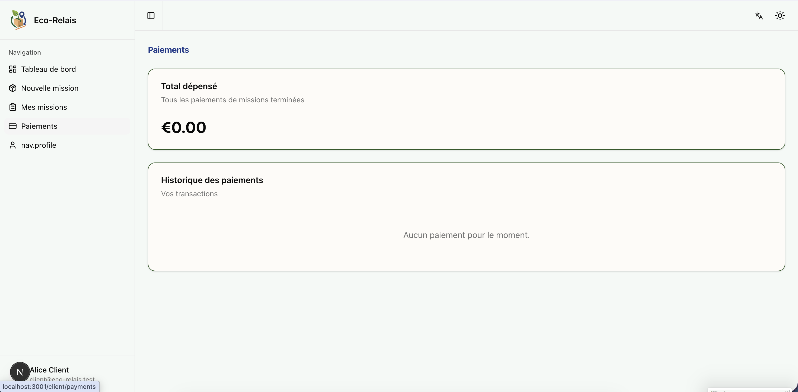
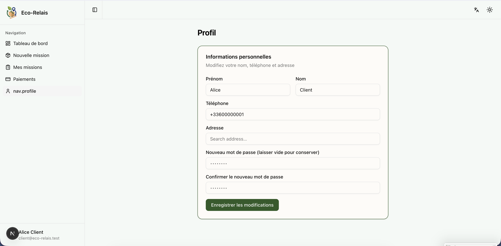

# Eco-Relais Dashboard (Frontend)

Application Next.js pour la plateforme de livraison hyperlocale **Eco-Relais**.

**Développement :** La branche `dev` est la branche d’intégration ; les branches de fonctionnalités y sont fusionnées avec `--no-ff`. Ne pas pousser sur `main` dans ce workflow.

## Documentation du projet

- **Vue d’ensemble et guide du code :** `docs/PROJECT.md`

## Stack technique

- **Next.js 14+** (App Router) + TypeScript
- **shadcn/ui** (composants type dashboard)
- **Tailwind CSS** (v4)
- **React Hook Form** + validation **Zod**
- **TanStack Query** pour les appels API et le cache
- **Zustand** pour l’état d’authentification
- **Google Maps API** (Places + Maps)
- **next-qrcode** / **qrcode.react** pour l’affichage des QR, **html5-qrcode** pour le scan
- **Stripe** (Elements / Checkout)
- **Lucide React** (icônes)
- **next-themes** (mode sombre)

## Installation et démarrage

```bash
npm install
cp .env.example .env.local
# Éditer .env.local : NEXT_PUBLIC_API_URL et NEXT_PUBLIC_GOOGLE_MAPS_API_KEY
npm run dev
```

Ouvrir [http://localhost:3000](http://localhost:3000). Redirection vers `/login`.

## Routes

- **Auth :** `/login`, `/register` (inscription en plusieurs étapes : rôle → infos → adresse)
- **Client :** `/client/dashboard`, `/client/new-mission`, `/client/missions`, `/client/missions/[id]`, `/client/payments`, `/client/profile`
- **Partenaire :** `/partner/dashboard`, `/partner/available`, `/partner/missions`, `/partner/earnings`, `/partner/profile`
- **Admin :** `/admin/dashboard`, `/admin/users`, `/admin/missions`, `/admin/disputes`, `/admin/settings`

## Fonctionnalités

- Routes protégées (vérification auth côté client + JWT API)
- TanStack Query avec polling 30 s pour le statut des missions quand nécessaire
- Mises à jour optimistes pour les changements de statut de mission
- Google Maps : autocomplétion d’adresse (inscription, nouvelle mission, profil) et cartes des missions
- QR : affichage pour le détail mission client ; scanner pour collecte/livraison partenaire
- Stripe : redirection Checkout à la création de mission ; onboarding Connect et paiement partenaire
- Formulaires validés avec Zod ; toasts pour les actions ; squelettes de chargement ; error boundary et 404

## Variables d’environnement

| Variable | Description |
|----------|-------------|
| `NEXT_PUBLIC_API_URL` | URL de base de l’API (ex. `http://localhost:3001/api`) |
| `NEXT_PUBLIC_GOOGLE_MAPS_API_KEY` | Clé API Google Maps/Places |
| `NEXT_PUBLIC_STRIPE_PUBLISHABLE_KEY` | (Optionnel) Clé Stripe publique côté client |

## Tests

Tests unitaires et de composants avec **Vitest** et **React Testing Library**.

```bash
npm run test        # une exécution
npm run test:watch  # mode watch
```

Couverture : `lib/utils` (cn), `lib/utils/format` (formatCurrency, formatDate, formatDistance), `lib/validators/auth` (schémas login/register), `lib/stores/auth-store`, et la page de connexion (formulaire et lien inscription).

## Build

```bash
npm run build
npm start
```

## État du MVP (Minimum Viable Product):

Le MVP se concentre sur le flux critique : **Inscription -> création de mission -> Livraison par un voisin**

### Les fonctionnalités Opérationnelles
* **Authentification & Roles** : Inscription et connexion fonctionnelles pour les rôles Client, Partenaire & Admin
* **Dépôt de colis** : Formulaire de création de mission
* **Recherche de missions** : Visualisation des différentes missions disponible
* **Mes missions** : Visualisation des missions en cours et terminée
* **Profil utilisateur** : Gestion des informations personnelles de l'utilisateur
* **Internationalisation** : Support complet du Français et de l'Anglais
* **Ajout des CGU, CGV et RGPD** : Ajout des mentions légales
* **Themes** : Implementation d'un thème clair et d'un thème sombre

## En cours de finalisation 
* **Ajout des paiements** : Ajout des paiements via le partenaire Stripe
* **Google Maps API** : Implémentation de l'API de Google Maps

### Roadmap (Prévue pour la V2):
* **Système de messagerie** : Ajout d'un système de messagerie instantanée entre les clients et les partenaires
* **Système de badges** : Ajout d'un système de badge et de natation pour garandir le sérieux des expéditeurs et renforcer la sérénité des Voisins-Relais
* **Système de report** : Ajout d'un système de signalement pour les clients et les partenaires
* **Google Oauth** : Ajout d'un système de connexion avec Google
* **Notifications** : Ajout d'un système de notifications pour les clients et les partenaires


## Capture d'écran du site

### Dashboard


### Nouvelle Mission


### Missions


### Paiement


### Profil



